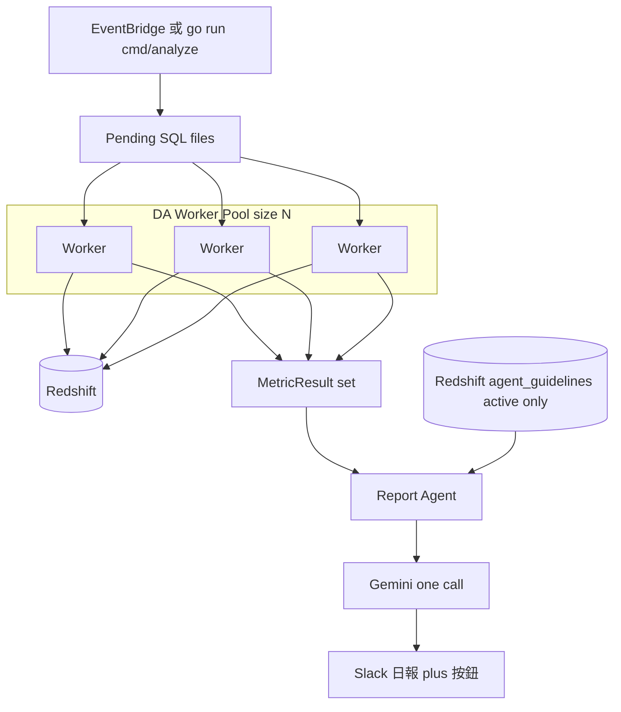
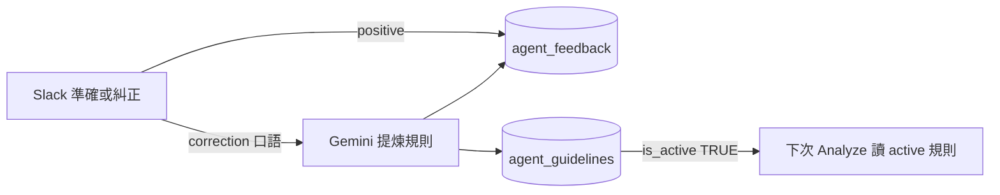

# DA Agents

每日數據分析 AI Agent：固定 N 個 DA Worker 查 Redshift `.sql` → Report Agent **一次**呼叫 Gemini → Slack；原則說明書與回饋也存在 **同一套 Redshift**。本機與 AWS Lambda 共用同一套核心。

## 目錄

1. [高層流程圖](#高層流程圖)
2. [Guideline 與 Feedback 作業流程](#guideline-與-feedback-作業流程)
3. [架構與記憶模型](#架構與記憶模型)
4. [Memory Schema](#memory-schema)
5. [快速開始](#快速開始)
6. [例行迭代與調教](#例行迭代與調教)
7. [專案結構與文件](#專案結構與文件)
8. [Code Review](#code-review)

---

## 高層流程圖

### 每日分析（Analyze）



重點：Worker **只查數**；LLM **只呼叫一次**；每次開跑都是獨立作業，靠重讀 guidelines 延續「記憶」。

### 回饋進化（Feedback → 下次分析）



---

## Guideline 與 Feedback 作業流程

兩張表職責不同，**不要混用**：

| | `agent_feedback` | `agent_guidelines` |
|--|------------------|-------------------|
| 是什麼 | **原始回饋日誌**（誰按了什麼） | **原則說明書**（下次要遵守的規則） |
| 進 Prompt？ | **否**（預設） | **是**（僅 `is_active = TRUE`） |
| 寫入時機 | 每次按「準確」或「糾正」 | 糾正提煉成功，或人手 `INSERT` |
| 用途 | 稽核、週審、追溯 | 動態組進 Report Agent Prompt |

### 作業怎麼走

```text
① 日報出現在 Slack
        │
        ├─ 按「準確」
        │     → 只寫 agent_feedback (positive)
        │     → 不新增 guideline（行為不變）
        │
        └─ 按「糾正 / 補充規則」→ 填 Modal（寫清楚正確做法）
              → 寫 agent_feedback (correction, raw_text=口語)
              → Gemini 提煉成 {category, rule_text}
              → INSERT agent_guidelines (source=slack_feedback, is_active=true)
              → feedback.derived_guideline_id 指向新規則
              → 【當次日報不重跑】下一輪 Analyze 才會讀到新規則
```

### 誰在什麼時候做什麼

| 何時 | 誰 | 做什麼 |
|------|-----|--------|
| 每日看報 | 分析師／主管 | Slack 點準確或糾正；糾正要寫「該怎麼做」 |
| 每週 | Data Owner | 對照 feedback↔guideline：合併重複、`is_active=FALSE` 停用噪音；若錯因是缺數 → 改 SQL 而非加規則 |
| 要立刻驗證新規則 | 任何人 | 手動再跑一次 `go run ./cmd/analyze`（或等隔日排程） |

### 糾正有效寫法

- 好：`DAU 不要跟 MAU 混著講；若只有日活躍，標題就寫 DAU。`
- 差：`你再認真一點。`

### 提醒：不是所有糾正都該變 guideline

| 錯因 | 寫哪裡 |
|------|--------|
| 解讀／口徑／格式 | `agent_guidelines`（Slack 糾正預設） |
| 缺指標、日期窗、聚合錯 | `queries/*.sql` |
| JSON／角色行為不穩 | `internal/prompt` 等程式 |
| 只留紀錄 | 僅 `agent_feedback`（按「準確」） |

關聯查詢（週審用）：

```sql
SELECT f.id, f.created_at, f.raw_text,
       g.id AS guideline_id, g.category, g.rule_text, g.is_active
FROM agent_feedback f
LEFT JOIN agent_guidelines g ON g.id = f.derived_guideline_id
WHERE f.feedback_type = 'correction'
ORDER BY f.created_at DESC
LIMIT 50;
```

---

## 架構與記憶模型

| 元件 | 職責 |
|------|------|
| DA Worker pool（`analyze.workers`） | 定數 N 消化 `.sql` → `MetricResult`（不呼叫 LLM） |
| Report Agent | 讀 active guidelines + 數據 → **一次** Gemini → 報告 JSON |
| Slack | 發日報；「準確／糾正」觸發 feedback 流程 |
| Redshift Memory | 同叢集上的 `agent_guidelines` + `agent_feedback` |

**沒有對話累積、沒有 Fine-tune。** 每次 analyze 獨立：重讀原則說明書 + 當日 SQL 結果組 Prompt。會持久化的是 guidelines／feedback／SQL／程式碼，不是模型權重或昨天的聊天全文。

執行環境（`internal/runtime`）：

- 自動：有 `AWS_LAMBDA_FUNCTION_NAME` 或 `LAMBDA_TASK_ROOT` → `lambda`，否則 `local`
- 覆寫：`DA_AGENT_ENV=local|lambda`
- 根目錄：`DA_AGENT_ROOT` > `LAMBDA_TASK_ROOT` > cwd

Local / Cloud 入口：

| 用途 | Local | Cloud |
|------|-------|-------|
| 分析 | `cmd/analyze` | EventBridge → `lambda-analyze` |
| Slack 互動 | `cmd/server` + ngrok | API GW / Function URL → `lambda-slack` |

---

## Memory Schema（Redshift）

來源：[`migrations/001_agent_memory.sql`](migrations/001_agent_memory.sql)。  
與分析 SQL **同一 Redshift**；小表用 `DISTSTYLE ALL`，不以 Postgres 的 `CREATE INDEX`／強制 FK。

### `agent_guidelines`（每次分析會讀）

```sql
CREATE TABLE IF NOT EXISTS agent_guidelines (
    id            INT IDENTITY(1,1) PRIMARY KEY,
    category      VARCHAR(50) NOT NULL,          -- metric_logic | formatting | context | investigation
    rule_text     VARCHAR(65535) NOT NULL,
    is_active     BOOLEAN DEFAULT TRUE,          -- FALSE = 不進 Prompt
    source        VARCHAR(50) DEFAULT 'manual',  -- manual | slack_feedback
    created_at    TIMESTAMP DEFAULT GETDATE(),
    updated_at    TIMESTAMP DEFAULT GETDATE()
)
DISTSTYLE ALL
SORTKEY (is_active, category, id);
```

#### `category` 四類的意義

`category` 是**固定四類**，用來標記「這條規則在管什麼」。它會跟著規則顯示給模型（Prompt 內每條長 `- [category] rule_text`），並依 category 分群排序後才送進 Prompt（`SORTKEY` + 查詢 `ORDER BY category`）。透過 Slack 糾正自動提煉時，模型若給出非四類的值會被**強制歸為 `context`**（`internal/llm/gemini.go`）。

| category | 管什麼（意義） | 影響報告的哪個面向 | 預設種子規則（migration 內建） |
|----------|----------------|--------------------|--------------------------------|
| `metric_logic` | 指標定義／口徑／計算邏輯 | 數字**怎麼被解讀** | 「不要把 DAU 與 MAU 混為一談；每個指標都必須標明日期區間。」 |
| `formatting` | 報告的呈現方式 | 報告**長什麼樣** | 「全程繁中；簡潔條列，優先呈現最重要的異常。」 |
| `context` | 對比與背景 | 要**跟什麼比、補什麼背景** | 「同時有昨日與上週對比時，必須一併比較並說明差異。」 |
| `investigation` | 異常時的下一步寫法 | 發現異常後**怎麼描述後續** | 「標異常只描述調查方向；**不得提供 SQL／程式碼**，也不得臆造查核結果。」 |

> 四類是給人維運（週審、去重、避免規則打架）用的組織維度，同時讓模型知道規則類型；它**不做加權或過濾**——凡 `is_active=TRUE` 的規則，不分類別都會進 Prompt。

### `agent_feedback`（原始日誌，預設不進 Prompt）

```sql
CREATE TABLE IF NOT EXISTS agent_feedback (
    id                     INT IDENTITY(1,1) PRIMARY KEY,
    raw_text               VARCHAR(65535),
    feedback_type          VARCHAR(20) NOT NULL, -- positive | correction
    slack_user_id          VARCHAR(50),
    slack_message_ts       VARCHAR(50),
    derived_guideline_id   INT,                  -- 邏輯關聯 guidelines.id（Redshift 不強制 FK）
    created_at             TIMESTAMP DEFAULT GETDATE()
)
DISTSTYLE ALL
SORTKEY (feedback_type, created_at, id);
```

```bash
psql "$REDSHIFT_CONN_STR" -f migrations/001_agent_memory.sql
```

---

## 快速開始

### 前置

1. Redshift 就緒（分析 query + memory 表同一叢集），並套用上方 migration  
2. Gemini API key、Slack App（Bot Token、Signing Secret、Channel ID）  
3. 設定檔：

```bash
cp config/goodnight/config.example.yaml config/goodnight/config.yaml
```

環境變數可覆寫：`REDSHIFT_CONN_STR`、`GEMINI_API_KEY`、`SLACK_BOT_TOKEN`、`SLACK_SIGNING_SECRET`、`SLACK_CHANNEL_ID`、`DA_AGENT_WORKERS`。

### 本機

```bash
export PATH="$HOME/sdk/go1.26.4/bin:$PATH"

# 分析
go run ./cmd/analyze -product goodnight

# Slack 互動（另開 ngrok http 8080，Interactivity URL → .../slack/interactions）
go run ./cmd/server -product goodnight
```

### 雲端

完整打包／部署／更新見 **[docs/DEPLOY.md](docs/DEPLOY.md)**。

```bash
chmod +x deploy.sh
export AWS_LAMBDA_ANALYZE_NAME=da-agents-analyze   # 可選：自動上傳
export AWS_LAMBDA_SLACK_NAME=da-agents-slack
./deploy.sh goodnight
```

| Lambda | 觸發 |
|--------|------|
| analyze | EventBridge 排程 |
| slack | Function URL / API Gateway → `/slack/interactions` |

Runtime：`provided.al2023`，handler `bootstrap`，架構與 `GOARCH` 一致（預設 arm64）。

### 新增分析 SQL

放入 `queries/<product>/*.sql`（檔名＝指標名）。完整格式與範例見 **[docs/DA_WORKER_GUIDELINE.md](docs/DA_WORKER_GUIDELINE.md)**。

#### 查詢結果規範（Query result 契約）

Worker 只執行 SQL、把結果轉成 markdown 表送進 Prompt。**結果的列數 × 欄數 × 每格長度，就是每天 token 成本的大宗**，所以「結果要小而聚合」不是風格問題，是成本問題：

| 規範 | 做法 | 為什麼 |
|------|------|--------|
| **只送聚合，不送明細** | 先 `GROUP BY` / 視窗聚合；禁止把 raw event 大表丟出來 | 明細列數會讓 token 爆炸 |
| **列數要小** | 目標個位數～數十列（單列 KPI 或近 7～30 日序列） | `analyze.max_rows_per_query` 只是**截斷安全網**（超過就砍尾），不是配額 |
| **欄數精簡** | 只 `SELECT` 報告會用到的欄；不要 `SELECT *` | 每多一欄 = 每列都多一格 |
| **數值先收斂** | 比率／百分位一律 `ROUND(...)`（例如 4 位）；避免 `0.123456789` 這種長浮點 | 長數字既佔 token 又難讀 |
| **時間窗可見** | 結果列帶出 `report_date` 或 `date_from`/`date_to` | 讓模型知道時間範圍，不必猜 |
| **欄名可讀** | 英文 `snake_case`、語意清楚：`dau`、`arppu`、`wow_delta` | 模型與人都靠欄名理解 |
| **一檔一指標** | 一個 `.sql` 只服務一個指標／一塊摘要 | 方便報告引用、失敗隔離 |

#### 指標元資料（放在 `.sql` 最上方，會進 Prompt 幫模型交叉參照）

```sql
-- @description: 付費用戶消費的人均、中位、分位
-- @role: supporting          -- primary | supporting | context（省略＝primary）
-- @supports: can_revenue     -- 這支服務的 primary 指標檔名（不含 .sql），逗號分隔
SELECT ...
```

> 業務**解讀規則**（如「DAU 不要跟 MAU 混」）寫進 `agent_guidelines`，不要寫死在 SQL 註解——執行時只送查詢結果，不送檔案註解。

---

## 例行迭代與調教

本系統**不做 Fine-tuning**。改動優先序（成本由低到高）：

| 優先 | 改什麼 | 何時 | 重部署？ |
|------|--------|------|----------|
| 1 | `agent_guidelines` | 解讀／格式／口徑 | 否 |
| 2 | `queries/*.sql` | 缺數、窗錯、聚合 | 要 |
| 3 | Prompt／程式 | schema、管線行為 | 要 |

```text
報告錯了？
 ├─ 數字錯／缺欄     → 改 SQL
 ├─ 數字對、解讀錯   → 改 guideline（或 Slack 糾正）
 ├─ 結構／JSON 不穩  → 調 prompt / model
 └─ 同一錯反覆出現   → 查 is_active、規則是否互相打架
```

### 節奏

1. **每日**：Slack 準確／糾正  
2. **每週**：週審 feedback↔guidelines；該改 SQL 的挑出去  
3. **每週／雙週**：補 query 後 `deploy.sh` 更新 analyze  
4. **每月**：瘦身 active 規則（合併／停用），避免 Prompt 膨脹  

### 調教＝動態組 Prompt（不是訓練）

```text
systemRole（程式）
  + active guidelines（Redshift，依 category）
  + MetricResult markdown
  → 一次 Gemini → Slack
```

四類 category 的意義見上方 [Memory Schema 的 `category` 說明](#category-四類的意義)；下 guideline 時挑對應那類即可。注意 `investigation` 只寫**調查方向**，不寫 SQL／程式碼。

規則要短、一條一事。人手維護範例：

```sql
INSERT INTO agent_guidelines (category, rule_text, is_active, source)
VALUES ('metric_logic', '付費用戶僅計當日扣款成功者，不含試用。', TRUE, 'manual');

UPDATE agent_guidelines
SET is_active = FALSE, updated_at = NOW()
WHERE id = 123;
```

換 `gemini.model` 或調 temperature：僅在 guidelines + SQL 都合理後仍不夠用時再動。

---

## 專案結構與文件

```
cmd/analyze            # local 分析
cmd/server             # local Slack HTTP
cmd/lambda-analyze     # EventBridge → 分析
cmd/lambda-slack       # API → Slack 互動
internal/worker        # 固定 N pool
internal/report        # 一次 Gemini 彙總
internal/pipeline      # 編排
queries/               # Redshift SQL
migrations/            # Redshift memory schema
config/<product>/      # YAML
docs/
  DEPLOY.md              # 打包與部署
  DA_WORKER_GUIDELINE.md # Worker 結果格式與 SQL 準則
  PROMPT_LAYOUT.md       # 每日 Prompt 結構
  code_review_guide.md   # Code review 盤點流程
  WORKLOG.md             # 工作日誌與待辦（各階段完成度／啟用步驟）
```

## Code Review

完整盤點流程（閱讀順序、分層清單、失敗場景、結論模板）見 **[docs/code_review_guide.md](docs/code_review_guide.md)**。
