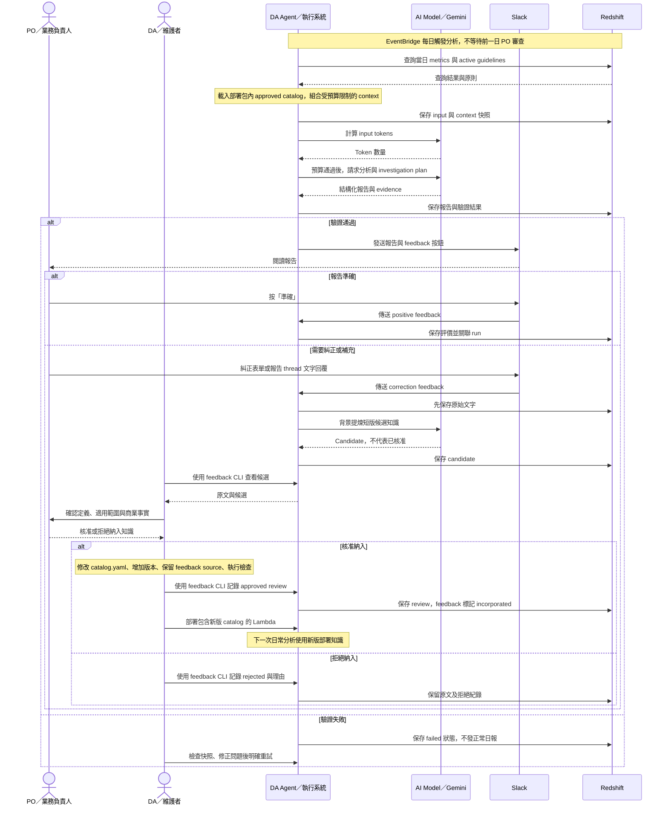
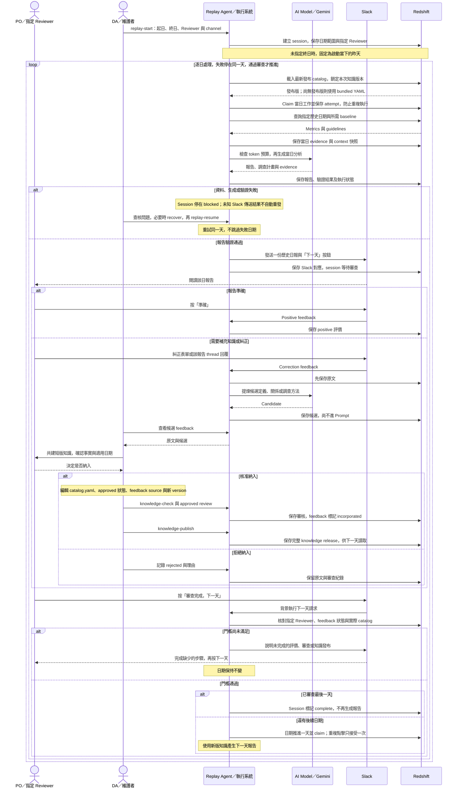

# DA Agents

以 PO feedback 持續改善的 Data Analyst Agent。沿用 Redshift → Lambda → Gemini → Slack，不增加向量資料庫或訓練平台。

日常流程：**查數 → 保存快照 → 挑選相關知識 → 檢查 Prompt 預算 → 生成及驗證 → Slack → 保存 feedback → PO 審查 → 更新版本**。

## 從這裡開始

- [工作流程](docs/WORKFLOW.md)：每日分析、feedback 審查、短版知識編輯與重試。
- [開發規範](docs/DEVELOPMENT.md)：SQL 契約、資料模型、Prompt、驗證與測試。
- [部署](docs/DEPLOY.md)：migration、設定、Lambda／Slack 啟用與回滾。
- [下一階段](docs/ROADMAP.md)：待開發的評測與模型訓練邊界。

Go 1.26.4；GoLand 開啟此專案原目錄。先依部署文件安裝資料表與 config，再執行：

```bash
make check PRODUCT=goodnight
make analyze PRODUCT=goodnight
make server PRODUCT=goodnight
make feedback-list PRODUCT=goodnight
```

`check` 不連線 DB／Gemini／Slack；`analyze` 會查 DB、呼叫 Gemini 並發 Slack。`feedback-list` 只讀 DB。若 go 不在 PATH，可指定 `GO=/Users/jay/sdk/go1.26.4/bin/go`。


## 正式環境：日常使用與知識改善

角色分工：PO 在 Slack 閱讀報告、補充事實與確認業務口徑；DA／維護者整理 catalog、記錄審查與部署；Agent 執行查數、保存與驗證；Gemini 生成報告並提煉候選知識。PO 與模型的互動由 Agent 轉送，不需要直接呼叫模型 API。



日常分析目前讀取**部署包內的 YAML catalog**；`knowledge-publish` 的 Redshift 發布版供 replay 使用，不會直接替換正式日報的 catalog。候選不會自動修改 YAML 或變成 active guideline；PO 若同時負責維護，也可以兼任圖中的 DA 角色。AI 呼叫或提煉失敗時保留可用紀錄，依 [工作流程](docs/WORKFLOW.md) 的 recovery 指令處理。

## Replay：逐日回放、審查與補齊知識

先確認核心 metrics 的定義，其餘業務關係可以隨案例逐步補充。啟動一次後，每一天都等待 PO 審查與明確的「下一天」操作；有新知識時才需要編輯、審核與發布，不需要每天重新啟動 replay。



「下一天」門檻是**至少一則 positive 或 incorporated correction，且所有 correction 都已 incorporated／rejected**；已納入的知識必須存在於實際使用的 catalog。只有 rejected 不代表報告已準確，仍需補準確評價或其他已納入的回饋。Slack thread 收件需先啟用 Events API；本機 replay 另需可接收 Slack 請求的 server。

查詢進度用 `replay-status`，失敗恢復用 `replay-resume`，捨棄舊 session 用 `replay-cancel` 後另行 `replay-start`。取消會保留歷史報告、feedback 與已發布知識。這個流程改善 Agent 使用的知識，沒有更新模型權重，也尚未自動重新生成前一天報告做品質比較。完整指令見 [工作流程](docs/WORKFLOW.md)，環境設定見 [部署文件](docs/DEPLOY.md)。

## 保存與學習

原則仍讀自 `da_squad.agent_guidelines`。產品的 metric catalog／business knowledge 放在 `knowledge/<product>/catalog.yaml`，由 Git 保存版本。原始分析與 PO feedback 放在既有 Redshift：analysis_runs、analysis_run_payloads、feedback、feedback_reviews。逐日回放另使用 replay_sessions、replay_attempts、knowledge_releases。

每筆知識只描述一個關係或方法，每個文字欄位一行、最多 240 字。approved 且本次相關的知識才進 Prompt；候選 feedback 不會自動變成 active guideline。

資料與知識可累積，單次 Prompt 有 byte、項目與 token 上限。不臆測原因；異常需要 investigation plan 和可核對的 source evidence。程式檢查結構與引用，商業解讀仍需 PO 審查。

本版支援逐日歷史 replay：啟動一次，Slack 審查後按「下一天」。操作見 [WORKFLOW.md](docs/WORKFLOW.md)。回放校準的是 Agent 知識，沒有更新模型權重。示範 catalog 的業務內容為 draft，需 PO 核對後啟用。
