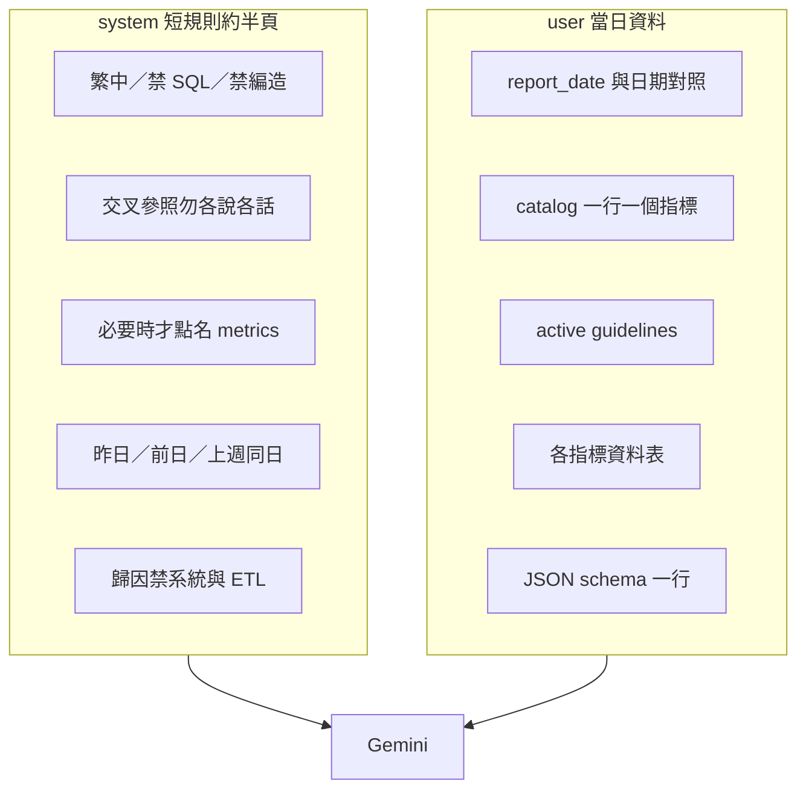

# Report Prompt 結構（精簡版）

每日只送一次 Gemini。固定規則放 **system**；**user** 只帶當日變動資料。

| 區塊 | 內容 | 是否每日變動 |
|------|------|--------------|
| system | 6 條站穩規則 | 否（程式常數） |
| dates | 昨日／前日／上週同日對照 | 是 |
| catalog | `指標名 [role] → 支援哪些指標` | 是 |
| guidelines | RDS active 規則 | 偶發 |
| data | 各表數字 | 是 |
| json | 輸出格式提醒 | 否（極短） |
