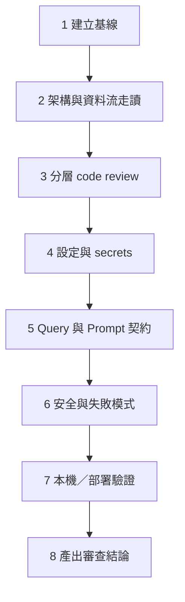

# Code Review 盤點指南（DA Agents）

本文件說明如何對本專案做一次完整 code review：建議閱讀順序、分層檢查清單、風險熱點與收斂產出。  
適用情境：上線前總盤、大改後回顧、新人接手架構。

相關文件：[README.md](../README.md)、[DEPLOY.md](DEPLOY.md)、[DA_WORKER_GUIDELINE.md](DA_WORKER_GUIDELINE.md)、[PROMPT_LAYOUT.md](PROMPT_LAYOUT.md)

---

## 0. Review 目標（先對齊）

這次盤點要回答的問題：

1. **正確性**：每日分析與 Slack 回饋路徑是否會靜默失敗或寫錯資料？
2. **邊界**：Worker／Report／Feedback 職責是否仍符合「不 fine-tune、一次 LLM、摘要進 Prompt」？
3. **安全**：secrets、Slack 簽名、連線字串是否外洩或驗證不足？
4. **成本／負載**：Redshift 併發、Prompt 長度、Gemini 呼叫次數是否可控？
5. **可維運**：local／Lambda 雙入口、deploy、設定是否可重現？

產出建議：一份「發現列表」（Critical / Major / Minor）+ 可選 follow-up PR 清單。

---

## 1. 盤點總流程（建議照此順序）



預計時間（熟悉 Go 者）：完整盤點約 **2～4 小時**；若含實機跑 analyze + Slack 按鈕，再加 **1 小時**。

---

## 2. 階段 1：建立基線

在改觀點評前先固定「現況可編譯、可測」。

```bash
export PATH="$HOME/sdk/go1.26.4/bin:$PATH"
cd /path/to/da-agents
go test ./...
go build ./...
```

檢查：

| 項目 | 通過條件 |
|------|----------|
| 模組 | `go.mod` 依賴合理，無多餘大型 SDK |
| 測試 | 至少 `runtime`、`sqlloader` 測試通過 |
| 入口 | `cmd/analyze`、`cmd/server`、`cmd/lambda-*` 可 build |
| 機密 | `config/**/config.yaml` 在 `.gitignore`；review 時**不要**把真實 token 貼進 PR／文件 |

記錄：Go 版本、目前 product（預設 `default`）、是否已套用 `migrations/001_agent_memory.sql`。

---

## 3. 階段 2：架構與資料流走讀（先圖後碼）

先讀 [README 高層流程](../README.md)，對照程式入口，確認「腦中的圖」與「碼」一致。

### 3.1 Analyze 路徑

```text
cmd/analyze 或 cmd/lambda-analyze
  → config.Load + Validate
  → pipeline.OpenAnalyze
  → sqlloader.LoadDir(queries/<product>)
  → worker.Pool（N）→ Redshift
  → memory.ListActiveGuidelines
  → prompt.BuildReportPrompt → llm.GenerateReport
  → slack.PostReport
```

重點檔：

| 檔案 | Review 看什麼 |
|------|----------------|
| [`cmd/analyze/main.go`](../cmd/analyze/main.go) | timeout、signal、錯誤是否 Fatal 合理 |
| [`cmd/lambda-analyze/main.go`](../cmd/lambda-analyze/main.go) | 與 local 是否共用 `pipeline.Run` |
| [`internal/pipeline/pipeline.go`](../internal/pipeline/pipeline.go) | 連線開關、query 路徑解析、單次失敗是否拖垮整批 |
| [`internal/worker/pool.go`](../internal/worker/pool.go) | 固定 N、ctx cancel、結果不丟、無 data race |
| [`internal/report/agent.go`](../internal/report/agent.go) | guidelines + metrics → 一次 LLM |
| [`internal/prompt/prompt.go`](../internal/prompt/prompt.go) | system 短、user 只帶當日資料；規則是否自相矛盾 |
| [`internal/llm/gemini.go`](../internal/llm/gemini.go) | timeout、非 2xx、JSON 解析失敗處理 |
| [`internal/slack/client.go`](../internal/slack/client.go) | postMessage blocks、scope 假設 |

### 3.2 Feedback 路徑

```text
cmd/server 或 cmd/lambda-slack
  → httpapi `/slack/interactions`
  → 驗簽 → positive / modal / view_submission
  → DistillGuideline → InsertGuideline + InsertFeedback
```

重點檔：

| 檔案 | Review 看什麼 |
|------|----------------|
| [`internal/httpapi/handler.go`](../internal/httpapi/handler.go) | 簽名、payload 解析、錯誤回 Slack 的方式 |
| [`internal/slack/client.go`](../internal/slack/client.go) | `VerifySignature`、Modal、`views.open` |
| [`internal/memory/store.go`](../internal/memory/store.go) | Redshift INSERT／查 id 的競態與錯誤包裝 |
| [`internal/runtime/runtime.go`](../internal/runtime/runtime.go) | local／lambda 判斷、`RootDir` |

Checklist（架構）：

- [ ] Worker **不**呼叫 LLM；Report **只**呼叫一次（分析路徑）
- [ ] Feedback 與 Guidelines 分表；口語不直接進 Prompt
- [ ] `report_date` 只影響標籤／「昨日」映射，**不**自動改 SQL
- [ ] local 與 Lambda 共用 `pipeline`／`httpapi`，無分叉業務邏輯

---

## 4. 階段 3：分層 Code Review

依「依賴由外到內」或「風險由高到低」皆可；建議下列分層。

### 4.1 Config／Runtime

- 必填欄位是否過嚴或過鬆（analyze vs server）
- env 覆寫是否覆蓋 yaml（`REDSHIFT_CONN_STR`、`GEMINI_API_KEY`、`SLACK_*`）
- `IsLambda`／`DA_AGENT_ENV` 覆寫是否可測、有無誤判

### 4.2 SQL 載入與 Worker

- [`sqlloader`](../internal/sqlloader/sqlloader.go)：`@desc`／`@role`／`@supports` 解析；meta 與 SQL 分離
- 空檔、非 `.sql`、目錄不存在的錯誤訊息
- Pool：`workers` 與 `SetMaxOpenConns` 是否一致
- `max_rows_per_query` 截斷後，Prompt 是否可能誤導模型（應在 guideline／desc 提醒完整度）

### 4.3 Redshift／Memory

- 連線 ping timeout、連線池生命週期、`Close` 是否成對
- Memory 表是否假設在**同一** Redshift（與文件一致）
- INSERT 後再 `SELECT id` 的併發安全性（Feedback 低併發通常可接受）
- Migration 是否為 Redshift 語法（`IDENTITY`、`DISTSTYLE`、無強制 FK）

### 4.4 Prompt／LLM

對照 [PROMPT_LAYOUT.md](PROMPT_LAYOUT.md)：

- [ ] system 夠短；規則無互相打架
- [ ] 繁中內文、禁 SQL、禁系統／ETL 歸因、日期相對語、交叉參照「必要時才點名 metrics」
- [ ] catalog 用 `@desc`，報告不提檔名
- [ ] Gemini：`responseMimeType` JSON、錯誤可觀測
- [ ] Distill prompt 與 guideline category 四選一一致

### 4.5 Slack／HTTP

- [ ] `chat.postMessage` 需要的 scope（`chat:write` 等）有文件說明
- [ ] 簽名驗證：timestamp 窗、HMAC compare
- [ ] Interactive：positive 只寫 feedback；correction 才寫 guideline
- [ ] Modal `private_metadata` 是否足夠追溯 message_ts
- [ ] Lambda adapter（API GW v2）路徑是否含 `/slack/interactions`

### 4.6 Deploy

- [ ] [`deploy.sh`](../deploy.sh)：`bootstrap`、打包 `config`+`queries`、可選 `update-function-code`
- [ ] analyze／slack **分開**函數與記憶體設定（見既有架構決策）
- [ ] 更新 SQL 是否必須重打包（是）

---

## 5. 階段 4：設定與 Secrets 盤點

| 檢查 | 做法 |
|------|------|
| 範例設定 | 只提交 `config.example.yaml`，無真實密鑰 |
| 本機設定 | `config.yaml` gitignore；review diff 時確認沒進版控 |
| Lambda | 敏感值優先環境變數，勿依賴 zip 內明文 |
| Slack | bot token / signing secret / channel 三者用途分開理解 |

**Review 禁令**：不要在 issue／PR 貼完整 `xoxb-`、API key、DB password。

---

## 6. 階段 5：Query 與 Prompt 契約盤點

對 `queries/<product>/*.sql` 逐檔：

| 檢查項 | 通過標準 |
|--------|----------|
| 列數 | 遠低於 `max_rows_per_query`（建議數十列內） |
| 日期 | 排除未結束的「今天」；與「昨日」報告對齊 |
| Meta | primary／supporting／desc 清楚；`supports` 指向存在的指標名 |
| 聚合 | 無 raw 明細灌進 Prompt |
| 可讀性 | 欄位別名清楚 |

對照 [DA_WORKER_GUIDELINE.md](DA_WORKER_GUIDELINE.md)。  
抽 1～2 支 supporting（人均／分位）確認模型規則會要求用來解釋 primary，而非孤立敘述。

---

## 7. 階段 6：安全與失敗模式（桌上演練）

針對每條路徑問：「失敗時使用者／日誌看到什麼？資料停在哪？」

| 場景 | 期望 |
|------|------|
| 單支 SQL 失敗 | 其他指標仍出報告；`failed_metrics`／ERROR 可見 |
| Gemini 4xx／5xx | analyze 失敗有明確 error；不半套寫入 Slack |
| Gemini JSON 壞掉 | 解析錯誤上報，不發殘缺報告（或明確策略） |
| Slack `missing_scope` | 錯誤可讀；不重試死迴圈 |
| 偽造 Interactive 請求 | 簽名失敗 → 401 |
| Guidelines 表不存在 | 啟動或查詢失敗訊息指向 migration |
| Prompt 過長 | 有列數上限；guidelines 過胖有週審流程（文件層） |

---

## 8. 階段 7：驗證（建議最小集合）

### 靜態

```bash
go test ./...
go vet ./...
```

### 動態（有權限時）

1. `go run ./cmd/analyze -product default` → Slack 出現日報  
2. （可選）`go run ./cmd/server` + ngrok → 按「準確」／「糾正」→ Redshift 有列  
3. 確認報告：繁中內文、相對日期、無 SQL、無系統／ETL 亂歸因  

### 部署（若本次含上雲）

依 [DEPLOY.md](DEPLOY.md) 檢查 zip 內容、環境變數、EventBridge／Interactivity URL。

---

## 9. 階段 8：產出審查結論

建議用固定模板：

```markdown
## Code Review 結論 — da-agents — YYYY-MM-DD

### 範圍
- commit / branch：
- 是否含 queries / prompt / deploy：

### Critical（必須修才能上）
1. …

### Major（應修）
1. …

### Minor / Nice to have
1. …

### 已確認 OK
- [ ] Analyze 單路徑一次 LLM
- [ ] Feedback 分表
- [ ] Secrets 未進 repo
- [ ] …

### Follow-up
- [ ] PR / issue 連結
```

嚴重度建議：

| 級別 | 例子 |
|------|------|
| Critical | 簽名可繞過、secrets 進 git、錯寫 production 表、分析成功但發錯頻道且無法察覺 |
| Major | 單 SQL 失敗拖垮整批、Prompt 與產品規則嚴重矛盾、Lambda／local 行為分叉 |
| Minor | 命名、註解、log 不足、文件過期 |

---

## 10. 建議檔案閱讀順序（速查）

第一次完整 review 可照此開檔：

1. `README.md`（心智模型）  
2. `internal/runtime` → `internal/config`  
3. `internal/pipeline`  
4. `internal/sqlloader` → `internal/worker` → `internal/redshift`  
5. `internal/memory` → `migrations/001_agent_memory.sql`  
6. `internal/prompt` → `internal/llm` → `internal/report`  
7. `internal/slack` → `internal/httpapi`  
8. `cmd/*`（四個入口是否瘦）  
9. `deploy.sh` + `docs/DEPLOY.md`  
10. `queries/<product>/*.sql` + `docs/DA_WORKER_GUIDELINE.md`  
11. `docs/PROMPT_LAYOUT.md`  

---

## 11. Review 時常見陷阱（本專案特有）

1. **以為 `report_date` 會過濾 SQL** — 不會；要在 query 自己排除「今天」。  
2. **以為 guidelines 會立刻重跑當日報告** — 糾正只影響**下一輪** analyze。  
3. **supporting 的 `@supports` 檔名** — 給機器對 catalog 用；報告內文不應念檔名。  
4. **列數被 `max_rows_per_query` 截斷** — 模型可能對殘缺表過度自信。  
5. **把系統／ETL 歸因寫進 guideline** — 與現行 prompt 規則衝突，週審時應刪。  
6. **Slack scope 沒重裝 App** — 加了 scope 但 token 仍舊 → `missing_scope`。  
7. **config.yaml 進 diff** — 立刻擋下，改用 example + env。

---

## 12. 精簡版 Checklist（可列印）

- [ ] `go test` / `go build` 通過  
- [ ] Analyze／Feedback 兩條路徑與 README 圖一致  
- [ ] Worker 無 LLM；Report 一次 LLM  
- [ ] Memory 在 Redshift；migration 可套用  
- [ ] Prompt 短、規則一致（日期／歸因／交叉參照／禁 SQL）  
- [ ] Slack 驗簽 + scope 文件化  
- [ ] Secrets 未進版控  
- [ ] Queries：列數、日期窗、meta  
- [ ] local／Lambda 入口無業務分叉  
- [ ] 審查結論已分 Critical／Major／Minor  
